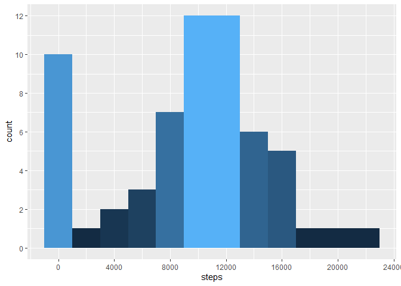
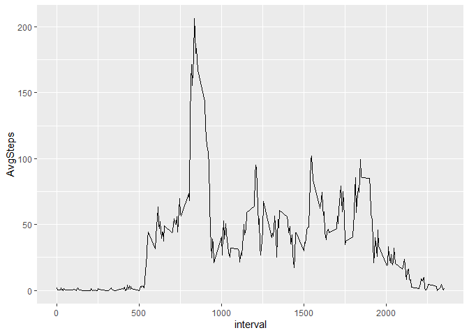
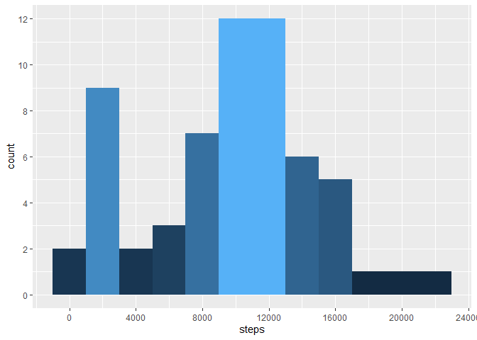
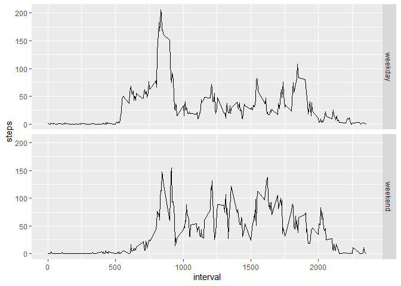

## Loading and preprocessing the data


```r
if(!file.exists("./activity.zip")){
    download.file("https://d396qusza40orc.cloudfront.net/repdata%2Fdata%2Factivity.zip", destfile = "activity.zip")
}
unzip("activity.zip")

library(data.table)
library(tidyverse)
df = fread("activity.csv")
```

## What is mean total number of steps taken per day?

```r
day_sum = df %>% group_by(date) %>% summarise(steps=sum(steps, na.rm = T))
dsm = mean(day_sum$steps)
dsmd = median(day_sum$steps)
ggplot(day_sum) + 
    geom_histogram(aes(x=steps, fill=..count..), binwidth = 2000) + 
    scale_x_continuous(breaks = seq(0, 24000, 4000)) + 
    scale_y_continuous(breaks = seq(0, 12, 2)) + guides(fill=F)
```

<!-- -->

### The mean and median of total steps taken are 9354.2295082 and 10395 respectively.

## What is the average daily activity pattern?

```r
avg = df %>% group_by(interval) %>% summarise(AvgSteps=mean(steps, na.rm = T))
ggplot(avg, aes(x=interval, y=AvgSteps)) + geom_line()
```

<!-- -->

```r
mxa = avg[which.max(avg$AvgSteps),]$interval
```

### Interval 835 contains the max number of steps on average.

## Imputing missing values

```r
med = with(df, tapply(steps, interval, median, na.rm = T))
idf = df %>% mutate(steps = if_else(is.na(steps), med[as.character(interval)], steps))
iday_sum = idf %>% group_by(date) %>% summarise(steps=sum(steps))
idsm = mean(iday_sum$steps)
idsmd = median(iday_sum$steps)
ggplot(iday_sum) + 
    geom_histogram(aes(x=steps, fill=..count..), binwidth = 2000) + 
    scale_x_continuous(breaks = seq(0, 24000, 4000)) + 
    scale_y_continuous(breaks = seq(0, 12, 2)) + guides(fill=F)
```

<!-- -->

### The mean and median of total steps taken after imputing NA values are 9503.8688525 and 10395 respectively.

### This mean is greater than the previous mean as the NA values have been replaced by positive values but the median remains same.

## Are there differences in activity patterns between weekdays and weekends?

```r
weekends = c("Saturday", "Sunday")
idf = idf %>% mutate(daytype = as.factor(if_else(weekdays(date) %in% weekends, "weekend", "weekday")))
ggplot(idf, aes(x=interval, y=steps)) + 
    stat_summary(fun = "mean", geom = "line") + facet_grid(rows = vars(daytype))
```

<!-- -->
